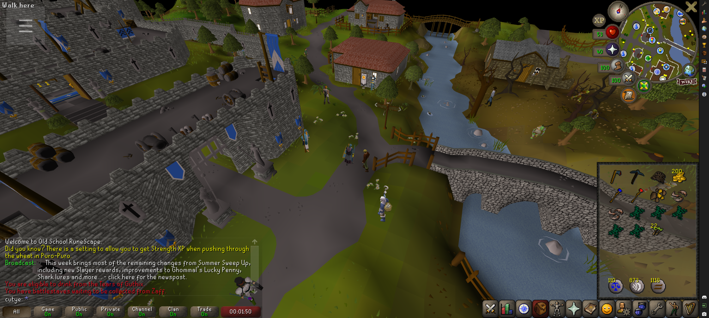
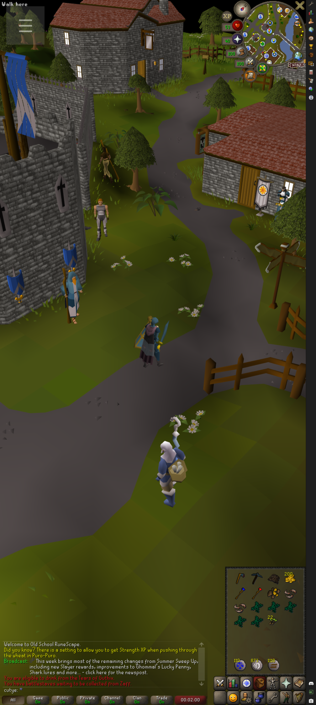

<p align="center">
  
</p>

<p align="center"><em>The desktop RuneLite client, running on Android.</em></p>

<p align="center">
  <a href="https://github.com/sturq/RunavaLauncher/actions/workflows/android.yml"></a>
  <a href="https://github.com/sturq/RunavaLauncher/releases/latest"></a>
</p>

RunavaLauncher is a single-APK port of the desktop [RuneLite](https://runelite.net/) client - the open-source third-party Old School RuneScape client - to Android. It launches the upstream RuneLite JAR inside a JRE 25 packaged with the app and renders it through a software AWT pipeline (Caciocavallo TTA), so you get the same RuneLite UI and the same plugin ecosystem you have on desktop, on your phone, without proot, without X11, without a separate runtime install.

Everything is bundled. Install one APK, tap the icon, log in, play.

<p align="center">
  
  
</p>

## Install

Grab the latest APK from the [releases page](https://github.com/sturq/RunavaLauncher/releases/latest) and sideload it. ~125 MB, arm64-v8a only.

## Logging in

Jagex accounts are supported. The app opens your normal browser for the password step, because
account.jagex.com is behind a bot check that refuses an in-app WebView outright.

1. Tap through the login in the browser that opens.
2. The browser then fails to load a page at `localhost`. That is the expected end of the flow:
   the address bar now holds your session.
3. Copy that whole address and switch back to the app. It is picked up automatically, and
   cleared from the clipboard once it has been used.
4. Pick your character.

The session is saved, so this happens once, not on every launch. "Jagex: log out" in the in-game
drawer forgets it. Old RuneScape accounts that were never migrated skip all of this and log in
through RuneLite itself.

## What works

* Full RuneLite client - login, world hop, chat, walking, combat, plugins, everything
* **Jagex account login**, without the desktop Jagex Launcher
* The entire RuneLite plugin sidebar - same versions as desktop
* **Audio** - sound effects, music, plugin sounds, through Android's AAudio output
* **Both orientations** - the game reflows when you rotate the device, no bars or stretching
* Touch controls for camera, taps, right-click, pinch-zoom
* Fullscreen, immersive layout; system gestures excluded from the right-edge UI strip
* Survives backgrounding - switch apps, take a call, come back, the game is still running
* Material You themed launcher icon

## Known limitations

* **Software-rendered.** RuneLite's GPU plugin (`librlawt.so`) needs glibc + X11 + GLX symbols that Android doesn't have. The CPU renderer is what runs, so the game's own render thread is the frame rate ceiling. Fine on a modern phone, but not desktop GPU-plugin numbers.
* **Logging in needs one copy and paste.** Desktop launchers catch the final redirect with a local server on port 80; an Android app may not bind a privileged port, and a browser never hands an `http://` address to an app.
* **Portrait is tight.** RuneLite's UI is built for landscape; in portrait everything reflows to fit, but the sidebar is necessarily narrower.

## Touch controls

| Gesture | Action |
| --- | --- |
| 1-finger tap | Left click |
| 1-finger long-press (≥ 200 ms, no movement) | Right click (opens OSRS context menu) |
| 1-finger drag in game world (left ~75% of screen) | Camera rotate (arrow keys) |
| 1-finger drag on RuneLite UI (right sidebar) | Left button held - inventory drag, minimap drag, etc. |
| 2-finger drag | Camera rotate (arrow keys) |
| 2-finger pinch | Zoom in / out (mouse wheel) |
| ☰ menu (top-left) | Drawer: keyboard, copy/paste, virtual mouse toggle, log viewer, Jagex log out, force-close |

Starting a camera drag also re-focuses the OSRS canvas, so arrow keys still rotate the camera even with the plugin search field open.

## Building

```bash
./gradlew :app_pojavlauncher:assembleDebug
```

GitHub Actions also builds a debug APK on every push and on a daily 04:00 UTC cron. The `latest` release tag is updated automatically from `main`.

## Architecture

Fork of [PojavLauncher](https://github.com/PojavLauncherTeam/PojavLauncher) / Amethyst-Android, gutted down to the JVM-hosting path:

* **FCL-Team's OpenJDK 25** for Android (`aarch64`, bundled as a JRE tar.xz). AngelAuraMC's JDK 17 and 21 both have a JNI handle-list bug in their `libjvm.so` that fires under Cacio's AWT peer calls - FCL-Team is a different OpenJDK port and dodges it.
* **Caciocavallo TTA** as the AWT toolkit (no X11), with our `TextureView` rendering Cacio's frame buffer as the on-screen surface.
* **`runelite_audio/`** - `javax.sound.sampled.spi.MixerProvider` on the JVM boot classpath, one shared AAudio output stream with a Java-side software mixer. `write()` never blocks the game thread.
* **`runelite_window_agent/`** - `-javaagent` loaded into the JVM. Sizes the RuneLite JFrame to the current orientation's visible aspect, periodically repaints to keep plugin sidebar icons fresh, refocuses the OSRS canvas on every camera drag, and runs a file-based IPC poller for mouse-wheel / right-click / FOCUSGAME / RESIZE events.

The `:runelitegame` Android process is separate from `:launcher` and is kept alive by a foreground service so Android doesn't reap the JVM mid-session.

## License

GPL-3.0, inherited from upstream PojavLauncher. RuneLite itself is BSD-2-Clause and is downloaded at runtime, not bundled.

## Credits

* [RuneLite](https://github.com/runelite/runelite) - the actual client
* [PojavLauncher](https://github.com/PojavLauncherTeam/PojavLauncher) - the JVM-on-Android scaffolding
* [Amethyst-Android](https://github.com/AngelAuraMC/Amethyst-Android) - the PojavLauncher fork this codebase started from
* [Caciocavallo](https://github.com/CaciocavalloSilano/caciocavallo) - pure-Java AWT toolkit, no X11 required
* [FCL-Team/Android-OpenJDK-Build](https://github.com/FCL-Team/Android-OpenJDK-Build) - the OpenJDK 25 port for Android we bundle

Not affiliated with Jagex or the RuneLite project. Use of RuneLite is subject to Jagex's third-party client guidelines.
